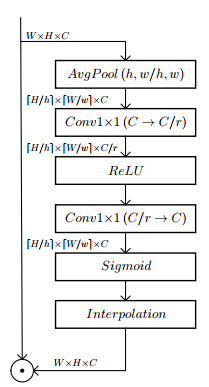
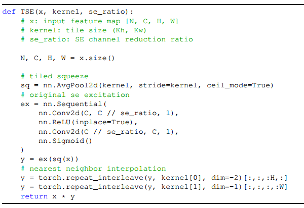
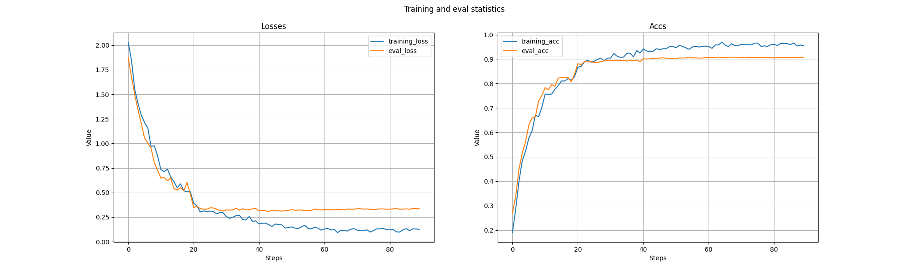
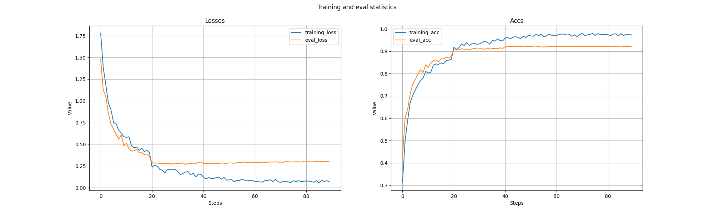
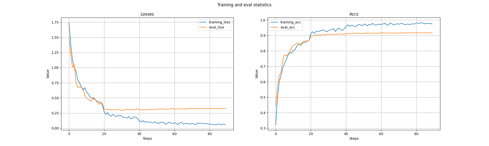

#  ***Tiled Squeeze-and-Excite: Channel Attention With Local Spatial Context***

First of all, thank the authors very much for sharing this excellent paper ***Tiled Squeeze-and-Excite: Channel Attention With Local Spatial Context*** with us. 
Paper addr: https://arxiv.org/abs/2107.02145

This repository contains unofficial implementation of TSE Attention and simple verification for modified VGG16
with CIFAR10. If there are some bug problems in the 
implementation, please send me an email at yuranusduke@163.com or simply add issue.

## Backgrounds
In this paper, authors believe that in original SE net, Global Average Pooling(GAP) is not necessary, and 
most importantly, in the backprop, AI hardware will store whole feature map according to GAP, which gives a bottleneck
in time efficiency. Therefore, instead of using GAP, they propose to use average pooling with kernel
and stride, and use `Conv2d` with 1x1 kernel size in the following nonlinear transformation. 
They propose to use larger kernel size(e.g. 7) in the deeper layer. But in this repo, we experiment with
small images(CIFAR10) instead of ImageNet, so we use kernel size 2.



And official pseudo code is,



One can read paper carefully to understand how and why they design architecture like this.

## Requirements

```Python
pip install -r requirements.txt 
```

## Implementation

We simply run CIFAR10 with modified VGG16.

### Hyper-parameters and defaults
```bash
--device = 'cuda' # learning device
--attn_ratio = 0.5 # hidden size ratio
--attn_method = 'se' # 'se' or 'none' or 'tse'
--pre_attn = 'se_to_tse' # 'none' or 'se_to_tse' or 'tse_to_se'
--epochs=80 # training epochs
--batch_size=64 # batch size
--init_lr=0.1 # initial learning rate
--gamma=0.2 # learning rate decay
--milestones=[40,60,80] # learning rate decay milestones
--weight_decay=9e-6 # weight decay
```

### Train & Test

```python
   python example.py main \
        --device='cuda' \
        --attn_ratio=0.5 \
        --attn_method='se' \
        --pre_attn='none' \
        --epochs=100 \
        --batch_size=20 \
        --init_lr=0.1 \
        --gamma=0.2 \
        --milestones=[20,40,60,80] \
        --weight_decay=1e-5

```

## Results

### TSE & SE with learning from scratch
| Model             | Acc.        |
| ----------------- | ----------- |
| baseline       	| 90.73%      |
| SE              	| 91.63%      |
| TSE               | **92.16%**  |

### TSE & SE with pretrained weights

According to paper, we use pretrained SE net to inject SE modules directly into TSE net in
test, and vice versa.
From this table, we observe, though we did not get ideal results, attention modules transferred
from TSE to SE are much more efficient than those transferred from SE to TSE.

| Method            | Acc.        |
| ----------------- | ----------- |
| SE->TSE           | 70.04%      |
| TSE->SE         	| **80.31%**  |


## Training statistics

### Baseline


### TSE with learning from scratch


### SE with learning from scratch



***<center>Veni，vidi，vici --Caesar</center>***
